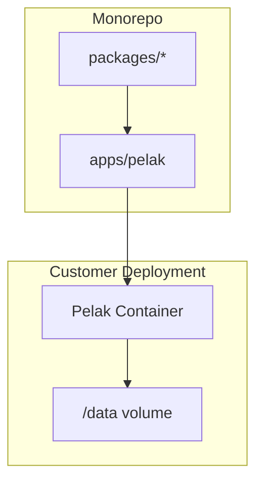
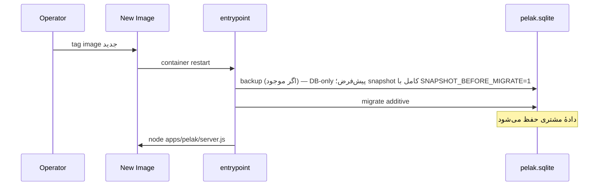
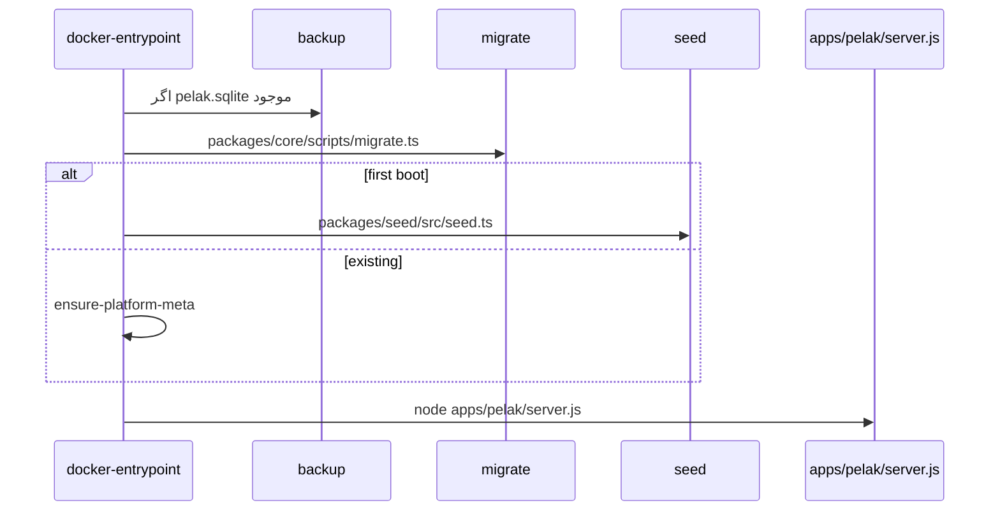

# معماری Nextgen CMS (Pelak)

## نمای کلی

هر مشتری یک **container** و یک **volume** (`/data`). Image مشترک از `Dockerfile` (ریشه repo)؛ تنها اپ deploy = `apps/pelak` (site عمومی + `/admin`).



## بخش هسته vs ماژول

```mermaid
flowchart LR
  subgraph core [بخش هسته — Core Section]
    C[content]
    M[members]
    MD[media]
    S[settings]
  end
  subgraph modules [ماژول — Feature Module]
    CG[contentGroup]
    V[video]
    N[newsletter]
  end
  Pelak[apps/pelak] --> core
  Pelak --> modules
  core --> SiteData[@nextgen-cms/site-data]
  core --> Studio[@nextgen-cms/studio]
  modules --> Studio
```

| لایه | UI فارسی | مجوز نمونه | مسیر ادمین |
|------|----------|------------|------------|
| هسته | محتوا، اعضا، مدیا | `content.*`, `members.*`, `media.*` | `/admin/content`, `/admin/members`, `/admin/media` |
| تنظیمات | تنظیمات | `settings.*` | `/admin/settings/*` |
| ماژول | گروه محتوا، ویدیو، خبرنامه | `modules.*` | `/admin/content-group`, `/admin/videos` |

فعال/غیرفعال ماژول: `settings.modules` (toggle) — CRUD محتوای ماژول: `modules.*`. جزئیات: `docs/STUDIO.md`.

## Packages

| Package | مسیر | نقش |
|---------|------|-----|
| `@nextgen-cms/contract` | `packages/contract` | Domain types + CMS field schemas + permissions |
| `@nextgen-cms/core` | `packages/core` | Drizzle schema, repos, migrations, paths/meta |
| `@nextgen-cms/config` | `packages/config` | Theme defaults, Next.js cache tags |
| `@nextgen-cms/site-data` | `packages/site-data` | `get-content` accessors (public) |
| `@nextgen-cms/studio` | `packages/studio` | CMS mutations, admin session |
| `@nextgen-cms/seed` | `packages/seed` | Fixtures + seed scripts |

> `packages/studio` package منطق admin است — appهای جداگانهٔ `apps/site` و `apps/studio` حذف شده‌اند.

## Upgrade path (production)



1. image جدید build/deploy (canonical: `docker compose -f docker-compose.yml up -d --build`)
2. startup: backup → `npm run db:migrate` (additive-only)
3. seed فقط first-boot — دادهٔ موجود دست‌نخورده
4. health: `GET /api/health`
5. برای DR: snapshot کامل (DB + uploads) از `/admin/settings/database` یا `npm run db:backup:snapshot`

جزئیات Docker: `docs/DEPLOYMENT.md` · migration policy: `docs/MIGRATION-POLICY.md`

## جریان startup



## platform_meta

| کلید | منبع |
|------|------|
| `core_version` | `@nextgen-cms/core` package.json |
| `schema_revision` | آخرین tag در `packages/core/drizzle/migrations` |
| `installed_at` | first-boot seed |

## Media lifecycle

فایل‌های آپلود در volume (`data/uploads/` یا `/data/uploads/`) نگه‌داری می‌شوند؛ متادیتا در جدول `media_assets`.

- **staging:** `members/{memberId}/draft/` — قبل از ثبت entity (مقاله، گروه، ویدیو، عضو)
- **نهایی:** `content/{id}/`, `content-group/{id}/`, `videos/{id}/`, `members/{id}/` (آواتار), `site/` (عمومی)
- **promote:** در save/create، URLهای استفاده‌شده از draft به فولدر entity منتقل می‌شوند (`promote-media.ts`)
- **بایگانی مقاله:** فقط `status` در DB — فایل‌ها در `content/{id}/` می‌مانند
- **حذف دائمی:** purge فولدر `content/{id}/`
- **serve:** `site/`, `members/{id}/` (غیر-draft), ماژول‌ها public؛ draft و مدیا مقالهٔ unpublished نیاز به session دارند
- **بکاپ:** فایل‌های آپلود بخش جدایی‌ناپذیر snapshot هستند چون DB فقط `folder_path` + `filename` نگه می‌دارد و URL در لحظه ساخته می‌شود. snapshot کامل (DB + uploads + manifest) در `packages/core/src/platform/snapshot.ts` پیاده‌سازی شده — رجوع کنید به `docs/DEPLOYMENT.md`.

جزئیات: `docs/STUDIO.md` · migration legacy: `npm run db:migrate-media-paths`

## فایل‌های کلیدی

- [`packages/site-data/src/get-content.ts`](../packages/site-data/src/get-content.ts)
- [`packages/core/src/db/schema/`](../packages/core/src/db/schema/)
- [`packages/core/src/platform/datetime.ts`](../packages/core/src/platform/datetime.ts)
- [`packages/contract/src/types/modules.ts`](../packages/contract/src/types/modules.ts)
- [`docker/docker-entrypoint.sh`](../docker/docker-entrypoint.sh)
- [`apps/pelak/app/api/health/route.ts`](../apps/pelak/app/api/health/route.ts)

## Settings hub

`/admin/settings` — ۵ تب مجوزمحور (personal, site, theme, roles, modules). تنظیمات بخش‌ها خارج از هاب: محتوا (`/admin/content/settings` با تب‌های «محتوا» و «موضوعات»)، اعضا، مدیا، گروه محتوا، ویدیو. دادهٔ تنظیمات در `site_settings` با ستون‌های JSON additive؛ پرچم `show_on_homepage` روی جدول `topics`.

## Route aliases

| قدیم | canonical |
|------|-----------|
| `/articles/*` | `/content/*` |
| `/authors/*` | `/members/*` |
| `/admin/articles/*` | `/admin/content/*` |
| `/admin/authors/*` | `/admin/members/*` |

redirectها در `apps/pelak/next.config.ts` — 308.

## UI

ساختار کامپوننت و roadmap: `docs/UI-BOUNDARY.md`
