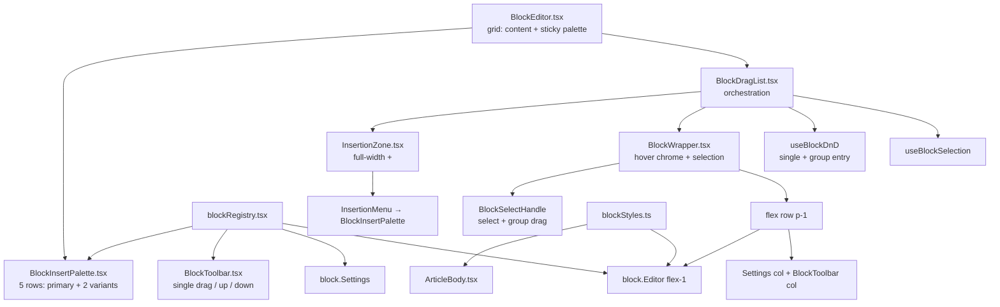
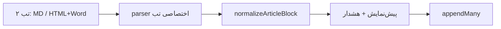

# Block Editor — حکمران

ادیتور بدنهٔ مقاله، مبتنی بر **رجیستری بلوک** و مدل **WYSIWYG سطح A** (تایپوگرافی سایت روی `textarea`/`input` بدون‌بردر؛ کروم فقط روی hover). مسیر: `apps/pelak/components/admin/blocks/`.

## انواع بلوک

| type | شکل داده | گروه | الگوی ادیتور |
|------|----------|------|--------------|
| `paragraph` | `{ type, content }` | text | ورودی تمام‌عرض شبیه سایت |
| `heading` | `{ type, level: 2\|3\|4, content }` | text | ورودی تمام‌عرض + `HEADING_CLASS` |
| `quote` | `{ type, content, attribution? }` | text | پوستهٔ `blockquote` سایت |
| `list` | `{ type, variant: "bullet"\|"ordered"\|"dash", items: string[] }` | text | `ul`/`ol` سایت؛ `dash` با علامت `−` |
| `question` | `{ type, content, answer? }` | text | ورودی داخل پوستهٔ پرسش (شبیه نقل‌قول) |
| `image` | `{ type, image: ImageMeta }` | media | پیش‌نمایش aspect-video (مثل ویدیو) با کنترل روی قاب؛ زیرنویس/اعتبار زیر تصویر |
| `video` | `{ type, src, caption? }` — آپارات | media | پیش‌نمایش aspect-video با لینک روی قاب؛ زیرنویس زیر قاب (مثل تصویر) |
| `table` | `{ type, headers: string[], rows: string[][] }` | media | سلول/هدر editable؛ Settings برای افزودن/حذف ردیف و ستون |
| `button` | `{ type, label, href, variant?: "primary"\|"outline"\|"secondary" }` | interactive | متن داخل دکمهٔ واقعی؛ لینک روبه‌رو؛ پیش‌فرض outline |

تایپ کانونیکال: `ArticleBlock` در `packages/contract/src/types/article.ts`.

کلاس‌های مشترک رندر سایت و ادیتور: `apps/pelak/components/article/blockStyles.ts`.

## معماری



### رجیستری

`blockRegistry.tsx` یک `Record<BlockType, BlockMeta>` است:

```ts
type BlockMeta = {
  type: BlockType;
  label: string;            // فارسی
  group: "text" | "media" | "interactive";
  Icon: BlockIcon;          // inline SVG
  createDefault: () => ArticleBlock;
  Editor: BlockEditorComponent;
  Settings?: BlockSettingsComponent;  // variants / in-family convert در Settings
};
```

`listInsertablePaletteRows()` پنج خانوادهٔ درج را برمی‌گرداند — در هر خانواده **یک دکمهٔ اصلی** (`h-10 w-10`) و **دو واریانت فرعی**. چیدمان بسته به `layout`:

| `layout` | محل | چیدمان |
|----------|-----|--------|
| `column` | ستون استیکی کنار ادیتور | ۵ ردیف عمودی — اصلی راست (`size-10`)، دو فرعی مربعی (`size-[19px]`) عمودی چپ؛ فاصله‌ها `gap-0.5` (۲px) |
| `menu` | منوی «افزودن» و `InsertionZone` | ۵ ستون افقی — اصلی بالا، دو فرعی مربعی کنار هم زیرش؛ فاصله‌ها `gap-0.5` (۲px) |

| ردیف/ستون | اصلی (بزرگ) | فرعی (کوچک) |
|-----------|-------------|-------------|
| ۱ | عنوان H2 | زیرعنوان H3 · ریزعنوان H4 |
| ۲ | پاراگراف | نقل‌قول · پرسش |
| ۳ | لیست نقطه‌ای | لیست شماره‌دار · لیست خط‌تیره |
| ۴ | تصویر | آپارات · جدول |
| ۵ | دکمه حاشیه‌دار | دکمه پررنگ · دکمه ثانویه |

`listInsertableBlocks()` همان ۱۵ ورودی را به‌صورت تخت (اصلی سپس دو فرعی در هر خانواده) از روی ردیف‌ها می‌سازد.

```
column (sticky)          menu (popover)
┌──┬────┐                ┌────┐ ┌────┐ … ×5
│فر│اصلی│                │اصلی│ │اصلی│
│عی│    │                ├─┬──┤ ├─┬──┤
│  │    │                │فر│فر│ │فر│فر│
└──┴────┘                └──┘ └──┘
```

هیچ منطقی در shell به نوع خاص گره نخورده — همه‌چیز از رجیستری / `listInsertablePaletteRows()` می‌آید.

### چیدمان shell (BlockEditor)

```
┌─ BlockEditor (lg:grid [1fr_auto]) ─────────────────────────┐
│ Content (space-y-3)              │ Sticky palette column   │
│  BlockDragList / empty state     │  (lg:sticky top-14)     │
│  CTA «افزودن» + menu             │  BlockInsertPalette 5 rows │
└──────────────────────────────────┴─────────────────────────┘
```

در فرم مقاله، ستون Save/Archive همچنان بیرون از BlockEditor در `ArticleForm` می‌ماند (`lg:grid [1fr_auto]` جدا).

### چیدمان (BlockWrapper) — hover chrome

در **idle** کارت بدون border/background/padding است و محتوا شبیه رندر سایت دیده می‌شود.

روی **hover** یا **focus-within** همان بلوک، کروم داخل ردیف محتوا (`flex` + `p-1`) دیده می‌شود:

```
┌─ BlockWrapper (p-1 flex row) ─────────────────────────────┐
│ Select col │ Settings col │ Toolbar col │ Content         │
│ group drag │ icon·delete  │ single drag │  outline نازک  │
│ (+ ▲ ▼     │ (+Settings   │ (+ ▲ ⇄ ▼    │  block.Editor  │
│  گروهی)    │  overlay)    │  تک)        │                │
└────────────┴──────────────┴─────────────┴────────────────┘
```

- ترتیب در ردیف (RTL start→end): **Select → Settings → Toolbar → محتوا**.
- ستون Select (`BlockSelectHandle`): همان الگوی Toolbar (footprint + absolute chrome عمودی: **انتخاب/درگ گروهی → ▲ → ▼**)؛ جابه‌جایی گروهی با ▲/▼ و درگ فقط از همین ستون.
- ترتیب Toolbar عمودی: **single drag → بالا → پایین**؛ ▲/▼ Toolbar فقط تک‌بلوک.
- ستون Settings: آیکون نوع (بر اساس سطح/واریانت: `resolveBlockChromeIcon`) + حذف؛ `Settings` با hover/`focus-within` به‌صورت overlay — گزینه‌ها آیکونی؛ تبدیل درون‌خانواده در Settings: `H2`/`H3`/`H4`؛ پاراگراف/نقل‌قول/پرسش؛ واریانت‌های لیست؛ واریانت دکمه؛ ابعاد جدول.
- بدون ring در idle؛ روی بلوک **انتخاب‌شده** `ring-1 ring-accent`. روی `BlockPlainTextarea` / `BlockPlainInput` در hover گروه یا `focus-visible`، outline نازک `accent` (۱px).
- روی انتخاب: فقط ستون Select همیشه visible می‌ماند؛ Settings و Toolbar با hover بلوک یا focus داخل همان ستون ظاهر می‌شوند — نه با focus روی Select. ساختار Toolbar با select عوض نمی‌شود؛ Transform در چندانتخاب فقط disabled است.
- لیبل نوع، حذف دو‌مرحله‌ای، و `Settings` در ستون Settings؛ فقط روی hover/`focus-within` chrome کل ستون visible.
- `focus-within` برای قابل‌استفاده ماندن دکمه‌های کروم با کیبورد.
- **انتخاب:** `BlockSelectHandle` با `GroupSelectIcon` (نماد ⌘ — چندانتخاب با ⌘/Ctrl+کلیک) به‌عنوان ستون اول کروم. انتخاب‌شده → رنگ accent قرمز (`bg-accent-soft` / `text-accent`) + ring کارت و ring ستون Select. state در `useBlockSelection` (`selectedKeys` + `selectionAnchorKey`). کلیک ساده = فقط همان / یا لغو اگر تنها انتخاب باشد؛ `Meta/Ctrl` = toggle؛ `Shift` = range؛ Escape = پاک کردن انتخاب (خارج از فیلد متنی).
- **درگ تکی vs گروهی (جدا):** grip در Toolbar همیشه فقط همان بلوک را جابه‌جا می‌کند و انتخاب را نمی‌خواند و عوض نمی‌کند. درگ گروهی فقط از ستون Select وقتی بیش از یک بلوک انتخاب شده و این بلوک جزو انتخاب است (`useBlockDnD.startSingleDrag` / `startGroupDrag`). منطق جابه‌جایی: `blockMove.ts` (`relocateKeys`).
- **حذف دو مرحله‌ای** (تک‌بلوک از Settings): کلیک اول → مسلح؛ کلیک دوم → حذف. پس از ۳ ثانیه یا blur، disarm. حذف گروهی فعلاً پشتیبانی نمی‌شود.
- `data-block-key` برای `scrollIntoView` پس از move/drop.
- `data-field="body.{i}"` روی `BlockWrapper` برای اسکرول به خطای اعتبارسنجی (جدا از `data-block-key`)؛ toast: `FormMessage` + `useFormFeedback` — `docs/UI-BOUNDARY.md`.
- در ادیتور، مارجین عمودی heading/quote/list صفر می‌شود (`my-0!`) تا ورودی‌ها نزدیک باشند؛ مارجین سایت از `blockStyles` دست‌نخورده می‌ماند.

### WYSIWYG سطح A

- ورودی‌های متنی از `BlockPlainTextarea` / `BlockPlainInput` (بدون border/bg فرم؛ outline فقط روی hover/focus).
- کلاس‌ها از `blockStyles.ts` — همان منبع `ArticleBody`.
- پرسش / تصویر / ویدیو (آپارات) / دکمه / جدول: ویرایش داخل پوستهٔ نمایش (نه دو ستون فرم جدا)، مگر فیلدهای جانبی ضروری روی قاب یا در Settings (ابعاد جدول، لینک دکمه، …).

### تعامل

- **درگ تکی (Toolbar)** — native HTML5 از grip Toolbar؛ همیشه یک بلوک؛ drop روی insertion zoneها (`dragActive` منبع پذیرش drop است).
- **چندانتخاب / درگ گروهی** — `BlockSelectHandle` برای انتخاب (ظاهر قرمز وقتی انتخاب‌شده)؛ درگ گروهی و ▲/▼ گروهی فقط از همان ستون؛ Toolbar فقط تک‌بلوک؛ تبدیل Settings در چندانتخاب غیرفعال است.
- **+ بین بلوک‌ها** — `InsertionZone` روی hover دکمهٔ `+` تمام‌عرض (border dashed)؛ منو = `BlockInsertPalette` با `layout="menu"` (۵ ستون افقی)؛ هنگام درگ همان footprint دکمهٔ `+` (بدون ارتفاع/مارجین اضافه) با border accent چشمک‌زن.
- **تبدیل نوع** — در ستون Settings (نه Toolbar): سطوح عنوان به‌هم؛ پاراگراف/نقل‌قول/پرسش با `ProseSettings` + `convertBlock`؛ واریانت لیست/دکمه؛ جدول فقط ابعاد. media به هم تبدیل نمی‌شوند.
- **حرکت با پیکان** — پس از move/drop، `scrollIntoView` روی اولین بلوک گروه؛ انتخاب حفظ می‌شود.
- **لیست** — Enter افزودن مورد، Backspace روی مورد خالی حذف.

### واردات محتوا

`BlockImportPanel.tsx` — پنل تاشو **بعد از** دکمهٔ «افزودن»، با **۲ تب**:

| تب | ورودی | Parser |
|----|--------|--------|
| Markdown | paste | `format: "markdown"` |
| HTML / Word | paste (کد HTML یا Word/مرورگر) | `importBlocksFromClipboard` — `text/html` در اولویت، وگرنه plain |

فقط paste — بدون انتخاب فایل. پس از parse، پیش‌نمایش + هشدارها؛ با تأیید، بلوک‌ها **به انتهای** `body` اضافه می‌شوند.



| منبع | بلوک مقصد | یادداشت |
|------|-----------|---------|
| `#` / `h1`–`h2` | `heading` 2 | `h1` Word → level 2 |
| `##` / `h3` | `heading` 3 | |
| `###`+ / `h4`–`h6` | `heading` 4 | سقف level 4 |
| پاراگراف / `p` | `paragraph` | استایل inline حذف |
| `blockquote` / `>` | `quote` | |
| `ul` / `-` | `list` bullet | لیست تو در تو flat |
| `ol` / `1.` | `list` ordered | |
| `table` / GFM | `table` | |
| `img` | `image` | URL → `src`؛ base64 → `src: ""` + هشدار |
| آپارات | `video` | |
| `details` | `question` | |
| لینک تنها در خط | `button` outline | |
| `hr`, `style`, MSO noise | **حذف** | `sanitizeImportHtml` |

**Parser:** `packages/contract/src/blocks/import/` — `importBlocksFromText`, `importBlocksFromClipboard`. وابستگی: `unified` + `remark-gfm` (Markdown)، `linkedom` (HTML).

**تصاویر placeholder:** بلوک `image` با `src` خالی و `alt` پر — validation فقط `alt` را الزامی می‌داند؛ قبل از انتشار از MediaPicker پر شود.

**محدودیت‌ها:** استایل Word (رنگ/فونت) حذف می‌شود؛ WYSIWYG سطح A فقط ساختار معنایی.

### RTL

فقط کلاس‌های منطقی Tailwind: `ps-`/`pe-`/`ms-`/`me-`/`start-`/`end-`/`border-s`/`border-e`. بدون `left/right`.

## ذخیره‌سازی

`articles.body` در SQLite به‌صورت JSON آرایه‌ای از `ArticleBlock`. دادهٔ قدیمی با `normalizeArticleBlock` نرمال می‌شود — **migration DB لازم نیست**.

## رندر عمومی

`apps/pelak/components/article/ArticleBody.tsx` از `blockStyles.ts` مصرف می‌کند. PDF: `lib/pdf/html/blocks.ts` + `lib/pdf/resolve-blocks.ts` + `lib/pdf/html/styles.ts`. آپارات: `lib/aparat.ts`.

### پیش‌نمایش ادمین و تصاویر draft

تصاویر آپلودی زیر `/uploads/content/{id}/…` تا زمان انتشار private هستند. `ArticleDetailView` prop `unoptimized` دارد که در پیش‌نمایش draft فعال می‌شود. جزئیات قبلی در همین سند حفظ شده: `next/image` بدون cookie → برای draft از مسیر مستقیم browser استفاده می‌شود.

## افزودن نوع بلوک جدید

1. **Contract** — عضو جدید در `ArticleBlock` در `packages/contract/src/types/article.ts` (+ `normalizeArticleBlock` در صورت نیاز).
2. **Validators** — `validateArticleBlocks` / `parseArticleBlocks` در `packages/studio/src/cms/validation/common.ts`. هر خطا `ValidationIssue` با `field: "body.{i}"` برمی‌گرداند تا UI به همان بلوک اسکرول کند.
3. **رجیستری + کامپوننت** — `blocks/FooBlock.tsx` + رکورد در `blockRegistry.tsx` + ردیف در `listInsertablePaletteRows()` (اصلی یا فرعی). برای text و interactive پوسته‌ای (پرسش/دکمه) و media قاب‌دار (تصویر/آپارات/جدول): ورودی بدون‌بردر داخل پوستهٔ `blockStyles.ts`.
4. **استایل مشترک** — ثابت‌های کلاس را در `blockStyles.ts` اضافه کن و در `ArticleBody` و Editor مصرف کن.
5. **رندر** — `ArticleBody.tsx` (+ PDF در صورت نیاز).
6. **Seed (اختیاری)** — `packages/seed/src/fixtures/articles.ts`.
7. **آیکون** — `blocks/icons.tsx` در صورت نیاز.
8. `npm run ci:check`.

## اسناد مرتبط

- `docs/UI-BOUNDARY.md` — ساختار کامپوننت‌ها
- `docs/CMS-SCHEMA.md` — `kind: "blocks"`
- skill `hokmran-studio` — مسیر ادیتور
