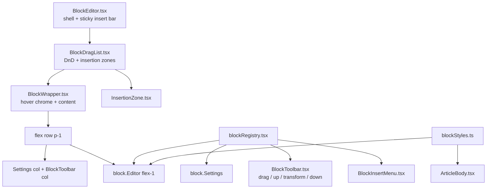

# Block Editor — حکمران

ادیتور بدنهٔ مقاله، مبتنی بر **رجیستری بلوک** و مدل **WYSIWYG سطح A** (تایپوگرافی سایت روی `textarea`/`input` بدون‌بردر؛ کروم فقط روی hover). مسیر: `apps/pelak/components/admin/blocks/`.

## انواع بلوک

| type | شکل داده | گروه | الگوی ادیتور |
|------|----------|------|--------------|
| `paragraph` | `{ type, content }` | text | ورودی تمام‌عرض شبیه سایت |
| `heading` | `{ type, level: 2\|3\|4, content }` | text | ورودی تمام‌عرض + `HEADING_CLASS` |
| `quote` | `{ type, content, attribution? }` | text | پوستهٔ `blockquote` سایت |
| `list` | `{ type, variant: "bullet"\|"ordered", items: string[] }` | text | `ul`/`ol` سایت + input بدون‌بردر |
| `question` | `{ type, content, answer? }` | interactive | ورودی داخل پوستهٔ پرسش (شبیه نقل‌قول) |
| `image` | `{ type, image: ImageMeta }` | media | پیش‌نمایش aspect-video (مثل ویدیو) با کنترل روی قاب؛ زیرنویس/اعتبار زیر تصویر |
| `video` | `{ type, src, caption? }` — آپارات | media | پیش‌نمایش aspect-video با لینک روی قاب؛ زیرنویس زیر قاب (مثل تصویر) |
| `button` | `{ type, label, href, variant?: "primary"\|"outline" }` | interactive | متن داخل دکمهٔ واقعی؛ لینک روبه‌رو |

تایپ کانونیکال: `ArticleBlock` در `packages/contract/src/types/article.ts`.

کلاس‌های مشترک رندر سایت و ادیتور: `apps/pelak/components/article/blockStyles.ts`.

## معماری



### رجیستری

`blockRegistry.tsx` یک `Record<BlockType, BlockMeta>` است:

```ts
type BlockMeta = {
  type: BlockType;
  label: string;            // فارسی
  group: "text" | "media" | "interactive";
  Icon: BlockIcon;          // inline SVG
  createDefault: () => ArticleBlock;
  Editor: BlockEditorComponent;
  Settings?: BlockSettingsComponent;  // در ستون کروم Settings
  convertibleTo: BlockType[];
};
```

هیچ منطقی در shell به نوع خاص گره نخورده — همه‌چیز از رجیستری می‌آید.

### چیدمان (BlockWrapper) — hover chrome

در **idle** کارت بدون border/background/padding است و محتوا شبیه رندر سایت دیده می‌شود.

روی **hover** یا **focus-within** همان بلوک، کروم داخل ردیف محتوا (`flex` + `p-1`) دیده می‌شود:

```
┌─ BlockWrapper (p-1 flex row) ─────────────────────────────┐
│ Settings col │ Toolbar col │ Content (flex-1 min-w-0)     │
│ label·delete │ drag        │  outline نازک روی ورودی     │
│ (+Settings   │ (+ ▲ ⇄ ▼    │                              │
│  on hover    │  on handle  │  block.Editor                │
│  overlay)    │  hover)     │                              │
└──────────────┴─────────────┴──────────────────────────────┘
```

- ترتیب در ردیف (RTL start→end): Settings → Toolbar → محتوا.
- ترتیب Toolbar عمودی: **drag → بالا → transform → پایین**؛ footprint فقط drag است و اکشن‌ها با hover/`focus-within` روی Toolbar به‌صورت overlay باز می‌شوند بدون رشد layout.
- ستون Settings: ابتدا فقط لیبل·حذف؛ `Settings` با hover/`focus-within` به‌صورت overlay بدون رشد layout.
- بدون ring دور کل بلوک؛ روی `BlockPlainTextarea` / `BlockPlainInput` در hover گروه یا `focus-visible`، outline نازک `accent` (۱px).
- لیبل نوع، حذف دو‌مرحله‌ای، و `Settings` در ستون Settings؛ فقط روی hover/`focus-within` chrome کل ستون visible.
- `focus-within` برای قابل‌استفاده ماندن منوی transform و دکمه‌ها با کیبورد — بدون state جداگانهٔ «انتخاب‌شده».
- **حذف دو مرحله‌ای**: کلیک اول → مسلح؛ کلیک دوم → حذف. پس از ۳ ثانیه یا blur، disarm.
- `data-block-key` برای `scrollIntoView`.
- در ادیتور، مارجین عمودی heading/quote/list صفر می‌شود (`!mt-0 !mb-0` / `!my-0`) تا ورودی‌ها نزدیک باشند؛ مارجین سایت از `blockStyles` دست‌نخورده می‌ماند.

### WYSIWYG سطح A

- ورودی‌های متنی از `BlockPlainTextarea` / `BlockPlainInput` (بدون border/bg فرم؛ outline فقط روی hover/focus).
- کلاس‌ها از `blockStyles.ts` — همان منبع `ArticleBody`.
- بلوک‌های media و دکمه: `grid sm:grid-cols-2` — نیمهٔ نمایش شبیه سایت، نیمهٔ تنظیمات با فیلدهای فرم. پرسش مثل نقل‌قول داخل همان پوسته ویرایش می‌شود.

### تعامل

- **درگ‌اند‌دراپ native** — drag handle در Toolbar؛ drop روی insertion zoneها.
- **+ بین بلوک‌ها** — `InsertionZone` روی hover علامت `+`؛ هنگام درگ خط accent چشمک‌زن.
- **تبدیل نوع** — `convertBlock`؛ منوی transform در Toolbar.
- **حرکت با پیکان** — پس از move/drop، `scrollIntoView`.
- **لیست** — Enter افزودن مورد، Backspace روی مورد خالی حذف.

### RTL

فقط کلاس‌های منطقی Tailwind: `ps-`/`pe-`/`ms-`/`me-`/`start-`/`end-`/`border-s`/`border-e`. بدون `left/right`.

## ذخیره‌سازی

`articles.body` در SQLite به‌صورت JSON آرایه‌ای از `ArticleBlock`. دادهٔ قدیمی با `normalizeArticleBlock` نرمال می‌شود — **migration DB لازم نیست**.

## رندر عمومی

`apps/pelak/components/article/ArticleBody.tsx` از `blockStyles.ts` مصرف می‌کند. PDF: `lib/pdf/html/blocks.ts` + `lib/pdf/resolve-blocks.ts` + `lib/pdf/html/styles.ts`. آپارات: `lib/aparat.ts`.

### پیش‌نمایش ادمین و تصاویر draft

تصاویر آپلودی زیر `/uploads/content/{id}/…` تا زمان انتشار private هستند. `ArticleDetailView` prop `unoptimized` دارد که در پیش‌نمایش draft فعال می‌شود. جزئیات قبلی در همین سند حفظ شده: `next/image` بدون cookie → برای draft از مسیر مستقیم browser استفاده می‌شود.

## افزودن نوع بلوک جدید

1. **Contract** — عضو جدید در `ArticleBlock` در `packages/contract/src/types/article.ts` (+ `normalizeArticleBlock` در صورت نیاز).
2. **Validators** — `validateArticleBlocks` / `parseArticleBlocks` در `packages/studio/src/cms/validation/common.ts`.
3. **رجیستری + کامپوننت** — `blocks/FooBlock.tsx` + رکورد در `blockRegistry.tsx`. برای text و پرسش: ورودی بدون‌بردر داخل پوستهٔ `blockStyles.ts`. برای media/دکمه: دو ستون نمایش\|تنظیمات.
4. **استایل مشترک** — ثابت‌های کلاس را در `blockStyles.ts` اضافه کن و در `ArticleBody` و Editor مصرف کن.
5. **رندر** — `ArticleBody.tsx` (+ PDF در صورت نیاز).
6. **Seed (اختیاری)** — `packages/seed/src/fixtures/articles.ts`.
7. **آیکون** — `blocks/icons.tsx` در صورت نیاز.
8. `npm run ci:check`.

## اسناد مرتبط

- `docs/UI-BOUNDARY.md` — ساختار کامپوننت‌ها
- `docs/CMS-SCHEMA.md` — `kind: "blocks"`
- skill `hokmran-studio` — مسیر ادیتور
