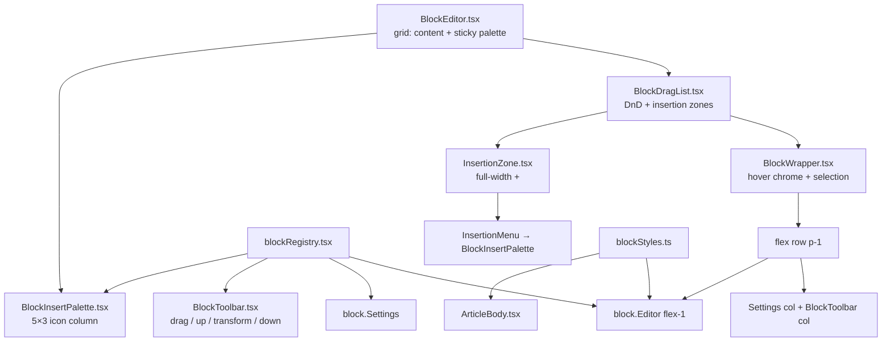

# Block Editor — حکمران

ادیتور بدنهٔ مقاله، مبتنی بر **رجیستری بلوک** و مدل **WYSIWYG سطح A** (تایپوگرافی سایت روی `textarea`/`input` بدون‌بردر؛ کروم فقط روی hover). مسیر: `apps/pelak/components/admin/blocks/`.

## انواع بلوک

| type | شکل داده | گروه | الگوی ادیتور |
|------|----------|------|--------------|
| `paragraph` | `{ type, content }` | text | ورودی تمام‌عرض شبیه سایت |
| `heading` | `{ type, level: 2\|3\|4, content }` | text | ورودی تمام‌عرض + `HEADING_CLASS` |
| `quote` | `{ type, content, attribution? }` | text | پوستهٔ `blockquote` سایت |
| `list` | `{ type, variant: "bullet"\|"ordered"\|"dash", items: string[] }` | text | `ul`/`ol` سایت؛ `dash` با علامت `−` |
| `question` | `{ type, content, answer? }` | text | ورودی داخل پوستهٔ پرسش (شبیه نقل‌قول) |
| `image` | `{ type, image: ImageMeta }` | media | پیش‌نمایش aspect-video (مثل ویدیو) با کنترل روی قاب؛ زیرنویس/اعتبار زیر تصویر |
| `video` | `{ type, src, caption? }` — آپارات | media | پیش‌نمایش aspect-video با لینک روی قاب؛ زیرنویس زیر قاب (مثل تصویر) |
| `table` | `{ type, headers: string[], rows: string[][] }` | media | سلول/هدر editable؛ Settings برای افزودن/حذف ردیف و ستون |
| `button` | `{ type, label, href, variant?: "primary"\|"outline"\|"secondary" }` | interactive | متن داخل دکمهٔ واقعی؛ لینک روبه‌رو؛ پیش‌فرض outline |

تایپ کانونیکال: `ArticleBlock` در `packages/contract/src/types/article.ts`.

کلاس‌های مشترک رندر سایت و ادیتور: `apps/pelak/components/article/blockStyles.ts`.

## معماری



### رجیستری

`blockRegistry.tsx` یک `Record<BlockType, BlockMeta>` است:

```ts
type BlockMeta = {
  type: BlockType;
  label: string;            // فارسی
  group: "text" | "media" | "interactive";
  Icon: BlockIcon;          // inline SVG
  createDefault: () => ArticleBlock;
  Editor: BlockEditorComponent;
  Settings?: BlockSettingsComponent;  // در ستون کروم Settings
  convertibleTo: BlockType[];
};
```

`listInsertableBlocks()` ترتیب صریح palette را برمی‌گرداند (۱۵ دکمه در ۵ سطر × ۳ ستون):

1. عنوان / زیرعنوان / ریزعنوان  
2. پاراگراف / نقل‌قول / پرسش  
3. لیست شماره‌دار / نقطه‌ای / خط‌تیره  
4. تصویر / ویدیو / جدول  
5. دکمه پررنگ / حاشیه‌دار / ثانویه  

هیچ منطقی در shell به نوع خاص گره نخورده — همه‌چیز از رجیستری / insertables می‌آید.

### چیدمان shell (BlockEditor)

```
┌─ BlockEditor (lg:grid [1fr_auto]) ─────────────────────────┐
│ Content (space-y-3)              │ Sticky palette column   │
│  BlockDragList / empty state     │  (lg:sticky top-14)     │
│  CTA «افزودن» + menu             │  BlockInsertPalette 5×3 │
└──────────────────────────────────┴─────────────────────────┘
```

در فرم مقاله، ستون Save/Archive همچنان بیرون از BlockEditor در `ArticleForm` می‌ماند (`lg:grid [1fr_auto]` جدا).

### چیدمان (BlockWrapper) — hover chrome

در **idle** کارت بدون border/background/padding است و محتوا شبیه رندر سایت دیده می‌شود.

روی **hover** یا **focus-within** همان بلوک، کروم داخل ردیف محتوا (`flex` + `p-1`) دیده می‌شود:

```
┌─ BlockWrapper (p-1 flex row) ─────────────────────────────┐
│ Settings col │ Toolbar col │ Content (flex-1 min-w-0)     │
│ label·delete │ drag        │  outline نازک روی ورودی     │
│ (+Settings   │ (+ ▲ ⇄ ▼    │                              │
│  on hover    │  on handle  │  block.Editor                │
│  overlay)    │  hover)     │                              │
└──────────────┴─────────────┴──────────────────────────────┘
```

- ترتیب در ردیف (RTL start→end): Settings → Toolbar → محتوا.
- ترتیب Toolbar عمودی: **drag → بالا → transform → پایین**؛ footprint فقط drag است و اکشن‌ها با hover/`focus-within` روی Toolbar به‌صورت overlay باز می‌شوند بدون رشد layout.
- ستون Settings: ابتدا فقط لیبل·حذف؛ `Settings` با hover/`focus-within` به‌صورت overlay بدون رشد layout.
- بدون ring در idle؛ روی بلوک **انتخاب‌شده** `ring-1 ring-accent`. روی `BlockPlainTextarea` / `BlockPlainInput` در hover گروه یا `focus-visible`، outline نازک `accent` (۱px).
- لیبل نوع، حذف دو‌مرحله‌ای، و `Settings` در ستون Settings؛ فقط روی hover/`focus-within` chrome کل ستون visible.
- `focus-within` برای قابل‌استفاده ماندن منوی transform و دکمه‌ها با کیبورد.
- **انتخاب:** چک‌باکس به‌جای آیکون نوع در ستون Settings (جدا از drag handle). `selectedKeys` + `selectionAnchorKey` در `BlockDragList`. کلیک ساده = فقط همان / یا لغو اگر تنها انتخاب باشد؛ `Meta/Ctrl` = toggle؛ `Shift` = range؛ Escape = پاک کردن انتخاب (خارج از فیلد متنی). درگ بدون تیک فقط همان بلوک را جابه‌جا می‌کند و انتخاب را عوض نمی‌کند.
- **حذف دو مرحله‌ای** (تک‌بلوک از Settings): کلیک اول → مسلح؛ کلیک دوم → حذف. پس از ۳ ثانیه یا blur، disarm. حذف گروهی فعلاً پشتیبانی نمی‌شود.
- `data-block-key` برای `scrollIntoView` پس از move/drop.
- `data-field="body.{i}"` روی `BlockWrapper` برای اسکرول به خطای اعتبارسنجی (جدا از `data-block-key`)؛ toast: `FormMessage` + `useFormFeedback` — `docs/UI-BOUNDARY.md`.
- در ادیتور، مارجین عمودی heading/quote/list صفر می‌شود (`my-0!`) تا ورودی‌ها نزدیک باشند؛ مارجین سایت از `blockStyles` دست‌نخورده می‌ماند.

### WYSIWYG سطح A

- ورودی‌های متنی از `BlockPlainTextarea` / `BlockPlainInput` (بدون border/bg فرم؛ outline فقط روی hover/focus).
- کلاس‌ها از `blockStyles.ts` — همان منبع `ArticleBody`.
- پرسش / تصویر / ویدیو (آپارات) / دکمه / جدول: ویرایش داخل پوستهٔ نمایش (نه دو ستون فرم جدا)، مگر فیلدهای جانبی ضروری روی قاب یا در Settings (ابعاد جدول، لینک دکمه، …).

### تعامل

- **درگ‌اند‌دراپ native** — drag handle در Toolbar؛ drop روی insertion zoneها؛ با چندانتخاب، کل مجموعه به‌صورت run پیوسته جابه‌جا می‌شود.
- **چندانتخاب / جابه‌جایی گروهی** — چک‌باکس برای انتخاب؛ ▲/▼ و drag روی مجموعه وقتی بلوکِ در حال جابه‌جایی تیک خورده و بیش از یکی انتخاب شده؛ transform در حالت چندتایی غیرفعال است.
- **+ بین بلوک‌ها** — `InsertionZone` روی hover دکمهٔ `+` تمام‌عرض (border dashed)؛ منو = همان `BlockInsertPalette` آیکونی ۵×۳؛ هنگام درگ خط accent چشمک‌زن.
- **تبدیل نوع** — `convertBlock`؛ منوی transform در Toolbar (فقط تک‌انتخاب). `table` تبدیل‌پذیر نیست.
- **حرکت با پیکان** — پس از move/drop، `scrollIntoView` روی اولین بلوک گروه؛ انتخاب حفظ می‌شود.
- **لیست** — Enter افزودن مورد، Backspace روی مورد خالی حذف.

### RTL

فقط کلاس‌های منطقی Tailwind: `ps-`/`pe-`/`ms-`/`me-`/`start-`/`end-`/`border-s`/`border-e`. بدون `left/right`.

## ذخیره‌سازی

`articles.body` در SQLite به‌صورت JSON آرایه‌ای از `ArticleBlock`. دادهٔ قدیمی با `normalizeArticleBlock` نرمال می‌شود — **migration DB لازم نیست**.

## رندر عمومی

`apps/pelak/components/article/ArticleBody.tsx` از `blockStyles.ts` مصرف می‌کند. PDF: `lib/pdf/html/blocks.ts` + `lib/pdf/resolve-blocks.ts` + `lib/pdf/html/styles.ts`. آپارات: `lib/aparat.ts`.

### پیش‌نمایش ادمین و تصاویر draft

تصاویر آپلودی زیر `/uploads/content/{id}/…` تا زمان انتشار private هستند. `ArticleDetailView` prop `unoptimized` دارد که در پیش‌نمایش draft فعال می‌شود. جزئیات قبلی در همین سند حفظ شده: `next/image` بدون cookie → برای draft از مسیر مستقیم browser استفاده می‌شود.

## افزودن نوع بلوک جدید

1. **Contract** — عضو جدید در `ArticleBlock` در `packages/contract/src/types/article.ts` (+ `normalizeArticleBlock` در صورت نیاز).
2. **Validators** — `validateArticleBlocks` / `parseArticleBlocks` در `packages/studio/src/cms/validation/common.ts`. هر خطا `ValidationIssue` با `field: "body.{i}"` برمی‌گرداند تا UI به همان بلوک اسکرول کند.
3. **رجیستری + کامپوننت** — `blocks/FooBlock.tsx` + رکورد در `blockRegistry.tsx` + ردیف/دکمه در `listInsertableBlocks()`. برای text و interactive پوسته‌ای (پرسش/دکمه) و media قاب‌دار (تصویر/آپارات/جدول): ورودی بدون‌بردر داخل پوستهٔ `blockStyles.ts`.
4. **استایل مشترک** — ثابت‌های کلاس را در `blockStyles.ts` اضافه کن و در `ArticleBody` و Editor مصرف کن.
5. **رندر** — `ArticleBody.tsx` (+ PDF در صورت نیاز).
6. **Seed (اختیاری)** — `packages/seed/src/fixtures/articles.ts`.
7. **آیکون** — `blocks/icons.tsx` در صورت نیاز.
8. `npm run ci:check`.

## اسناد مرتبط

- `docs/UI-BOUNDARY.md` — ساختار کامپوننت‌ها
- `docs/CMS-SCHEMA.md` — `kind: "blocks"`
- skill `hokmran-studio` — مسیر ادیتور
