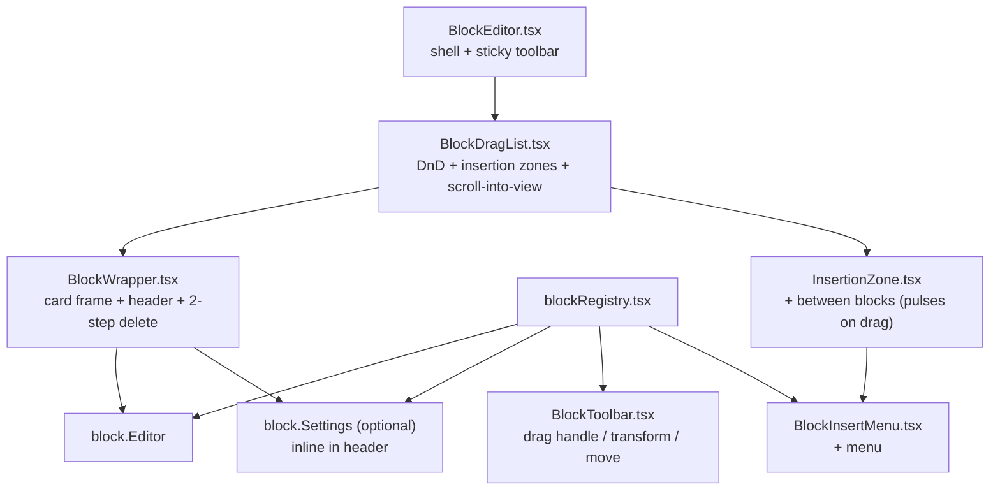

# Block Editor — حکمران

ادیتور بدنهٔ مقاله، مبتنی بر **رجیستری بلوک** و قابل‌گسترش. مسیر: `apps/pelak/components/admin/blocks/`.

## انواع بلوک

| type | شکل داده | گروه |
|------|----------|------|
| `paragraph` | `{ type, content }` | text |
| `heading` | `{ type, level: 2\|3\|4, content }` | text |
| `quote` | `{ type, content, attribution? }` | text |
| `list` | `{ type, variant: "bullet"\|"ordered", items: string[] }` | text |
| `question` | `{ type, content, answer? }` | text |
| `image` | `{ type, image: ImageMeta }` | media |
| `video` | `{ type, src, caption? }` — آپارات | media |
| `button` | `{ type, label, href, variant?: "primary"\|"outline" }` | interactive |

تایپ کانونیکال: `ArticleBlock` در `packages/contract/src/types/article.ts`.

## معماری



### رجیستری

`blockRegistry.tsx` یک `Record<BlockType, BlockMeta>` است:

```ts
type BlockMeta = {
  type: BlockType;
  label: string;            // فارسی
  group: "text" | "media" | "interactive";
  Icon: BlockIcon;          // inline SVG
  createDefault: () => ArticleBlock;
  Editor: BlockEditorComponent;
  Settings?: BlockSettingsComponent;  // کنترل‌های inline در هدر (مثل سطح heading)
  convertibleTo: BlockType[];         // تبدیل نوع
};
```

هیچ منطقی در shell به نوع خاص گره نخورده — همه‌چیز از رجیستری می‌آید.

### چیدمان کارت (BlockWrapper)

```
┌─────────────────────────────────────────────────────────┐
│ [drag│transform│▲▼]   …   [Settings]  icon  label  🗑 │  ← هدر (in-flow)
├─────────────────────────────────────────────────────────┤
│  block.Editor                                           │
└─────────────────────────────────────────────────────────┘
```

- نوار ابزار (drag handle / transform / move) در **ابتدای** هدر — در جریان، نه absolute.
- `Settings` (اختیاری) و icon/label/delete در **انتهای** هدر.
- **حذف دو مرحله‌ای**: کلیک اول → دکمه قرمز (armed)؛ کلیک دوم → حذف. پس از ۳ ثانیه یا blur خودکار disarm می‌شود.
- `data-block-key` روی کارت برای `scrollIntoView`.

### تعامل

- **درگ‌اند‌دراپ native** (HTML5) — بدون کتاب‌خانه. drag handle در نوار ابزار؛ drop روی insertion zoneها.
- **+ بین بلوک‌ها** — `InsertionZone` ناحیه‌ای نازک (~۲۰px) که روی hover علامت `+` نشان می‌دهد و منوی `BlockInsertMenu` را باز می‌کند. هنگام درگ، یک خط accent‌رنگ چشمک‌زن (`animate-block-drop-blink`) هدف drop را نشان می‌دهد.
- **تبدیل نوع** — `convertBlock(source, target)` متن اصلی را حفظ می‌کند؛ منوی transform در `BlockToolbar`.
- **حرکت با پیکان** — `BlockDragList` پس از move/drop بلوک را `scrollIntoView` می‌کند تا در دید بماند.
- **سطح heading** — Pills مستقیم در `HeadingSettings` داخل هدر کارت. سه دکمه در inserter بالا: عنوان (h2) / زیرعنوان (h3) / ریزعنوان (h4) با آیکون عدد فارسی.
- **تنظیمات inline** — `ListSettings` (bullet/ordered) و `ButtonSettings` (primary/outline) نیز در هدر.
- **لیست** — Enter برای افزودن مورد، Backspace روی مورد خالی برای حذف.

### RTL

فقط کلاس‌های منطقی Tailwind: `ps-`/`pe-`/`ms-`/`me-`/`start-`/`end-`/`border-s`/`border-e`. بدون `left/right`.

## ذخیره‌سازی

`articles.body` در SQLite به‌صورت JSON آرایه‌ای از `ArticleBlock`. دادهٔ قدیمی (مثل `heading` بدون `level`) با `normalizeArticleBlock` در زمان خواندن نرمال می‌شود — **migration DB لازم نیست**.

## رندر عمومی

`apps/pelak/components/article/ArticleBody.tsx` همهٔ انواع را رندر می‌کند. PDF: `lib/pdf/html/blocks.ts` + `lib/pdf/resolve-blocks.ts`. آپارات: `lib/aparat.ts`.

### پیش‌نمایش ادمین و تصاویر draft

تصاویر آپلودی زیر `/uploads/content/{id}/…` تا زمان انتشار private هستند و فقط با session ادمین سرو می‌شوند (رجوع به `packages/core/src/media/serve-access.ts`). `next/image` تصاویر را از طریق optimizer **بدون cookie** fetch می‌کند → برای draft ها 403 می‌شود.

به همین دلیل `ArticleDetailView` یک prop `unoptimized` دارد که در صفحهٔ پیش‌نمایش (`app/admin/(preview)/content/[id]/preview`) وقتی `status !== "published"` فعال می‌شود؛ آن‌گاه تصاویر مستقیم توسط browser (با cookie) fetch می‌شوند و در preview draft دیده می‌شوند. صفحهٔ عمومی (`app/content/[slug]`) این prop را پاس نمی‌دهد و همان optimizer را استفاده می‌کند.

## افزودن نوع بلوک جدید

1. **Contract** — عضو جدید در `ArticleBlock` (+ `BlockType` خودکار) در `packages/contract/src/types/article.ts`. اگر دادهٔ قدیمی ممکن است ناقص باشد، در `normalizeArticleBlock` پوششش بده.
2. **استValidators** — `validateArticleBlocks` و `parseArticleBlocks` در `packages/studio/src/cms/validation/common.ts`.
3. **رجیستری + کامپوننت** — فایل `apps/pelak/components/admin/blocks/blocks/FooBlock.tsx` + رکورد در `blockRegistry.tsx` (شامل `createDefault`، `Editor`، `convertibleTo`، و در صورت نیاز `Settings` برای کنترل‌های inline در هدر).
4. **رندر** — `ArticleBody.tsx` (و `lib/pdf/html/blocks.ts` + `resolve-blocks.ts` اگر لازم).
5. **Seed (اختیاری)** — fixture در `packages/seed/src/fixtures/articles.ts`.
6. **آیکون** — افزودن به `blocks/icons.tsx` اگر نوع آیکون جدید می‌خواهد.
7. `npm run ci:check`.

## اسناد مرتبط

- `docs/UI-BOUNDARY.md` — ساختار کامپوننت‌ها
- `docs/CMS-SCHEMA.md` — `kind: "blocks"`
- skill `hokmran-studio` — مسیر ادیتور
